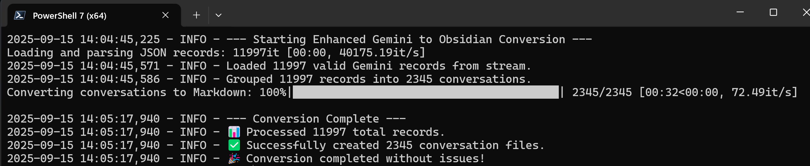

# Gemini to Obsidian Converter

Convert your Google Gemini chat history from Google Takeout into beautifully formatted Obsidian markdown notes.

## Features

- 🔄 **Clean Conversion**: Transforms HTML chat exports into clean markdown
- 📝 **Smart Formatting**: Proper YAML frontmatter with titles, dates, and auto-generated tags
- 📎 **Attachment Support**: Handles images, documents, and other file attachments
- 🏷️ **Auto-Tagging**: Intelligent keyword extraction for better organization
- 📁 **Date Organization**: Optional folder structure by year/month
- ⚡ **Bulk Processing**: Handles large chat histories efficiently

## Quick Start

1. **Export your data**: Request a Google Takeout with Gemini Apps data
2. **Install dependencies**: `pip install -r requirements.txt`
3. **Configure paths**: Edit the configuration section in `gemini_to_obsidian.py`
4. **Run conversion**: `python gemini_to_obsidian.py`

## Sample Output

Your chats become organized Obsidian notes with clean formatting and metadata:



The converter creates properly formatted markdown files with:

```markdown
---
title: "Best way to clean oxo coffee maker"
created: 2025-09-12 13:13:35
source: ''
tags:
  - ai/gemini/export
  - coffee
  - cleaning
  - maker
---

# Best way to clean oxo coffee maker

## You

Best way to clean oxo coffee maker

---

## Gemini

Finding the best way to clean your OXO coffee maker involves...
```

## Installation

### Prerequisites
- Python 3.7+
- Google Takeout export containing Gemini Apps data

### Dependencies
```bash
pip install -r requirements.txt
```

Required packages:
- `tqdm` - Progress bars
- `ijson` - Streaming JSON parsing
- `html2text` - HTML to markdown conversion

## Configuration

Edit these variables in `gemini_to_obsidian.py`:

```python
# Path to your unzipped Google Takeout folder
TAKEOUT_ROOT_PATH = 'C:/Users/username/Downloads/Takeout'

# Path to your Obsidian vault import folder
OBSIDIAN_OUTPUT_PATH = 'C:/Users/username/Documents/ObsidianVault/Gemini Imports'

# Additional settings
ORGANIZE_BY_DATE = True  # Create year/month subfolders
DRY_RUN = False         # Set to True to preview without creating files
```

## Getting Google Takeout Data

1. Go to [Google Takeout](https://takeout.google.com)
2. Select "Gemini Apps" (and deselect everything else for faster download)
3. Choose format: ZIP, 2GB max file size
4. Download and extract the ZIP file
5. Point `TAKEOUT_ROOT_PATH` to the extracted folder

## Usage Examples

### Basic Conversion
```bash
python gemini_to_obsidian.py
```

### Preview Mode (Dry Run)
Set `DRY_RUN = True` in the script to see what would be created without actually writing files.

### Debug Mode
Set `DEBUG_MODE = True` for detailed logging and troubleshooting.

## Output Structure

```
Obsidian Vault/
└── Gemini Imports/
    ├── 2025/
    │   └── 09/
    │       ├── Best way to clean oxo coffee maker.md
    │       └── Python debugging tips.md
    └── _attachments/
        ├── image1.png
        └── document.pdf
```

## Features in Detail

### Smart Title Extraction
- Removes "Prompted" prefixes
- Truncates long titles intelligently at word boundaries
- Uses conversation content as the actual note title

### Automatic Tagging
- Extracts meaningful keywords from conversations
- Filters out common stop words
- Creates clean, Obsidian-compatible tags

### Attachment Processing
- Copies and links images, documents, audio, and video files
- Handles missing attachments gracefully
- Creates appropriate Obsidian embed syntax

### YAML Frontmatter
- Properly escaped titles for YAML compatibility
- ISO timestamp formatting
- Source URL preservation
- Clean tag arrays

## Troubleshooting

### Common Issues

**"JSON file not found"**
- Verify your `TAKEOUT_ROOT_PATH` points to the extracted Takeout folder
- Ensure the path contains `My Activity/Gemini Apps/MyActivity.json`

**"No valid Gemini records found"**
- Check that your Takeout export included Gemini Apps data
- Try enabling `DEBUG_MODE` for more detailed logging

**HTML parsing errors**
- The script handles malformed HTML gracefully
- Check the console output for specific error details

### Performance Tips

- Large chat histories may take several minutes to process
- Use `DRY_RUN = True` first to verify settings
- Consider `ORGANIZE_BY_DATE = False` for simpler folder structure

## Contributing

This project is licensed for personal use only. If you'd like to contribute improvements:

1. Fork the repository
2. Create a feature branch
3. Submit a pull request with clear description

Please ensure any contributions maintain the personal-use-only licensing.

## License

This project is licensed under the Creative Commons Attribution-NonCommercial 4.0 International License - see the [LICENSE](LICENSE) file for details.

**Summary**: You are free to use, modify, and share this project for personal purposes only. Commercial use is prohibited.

## Acknowledgments

- Built for the Obsidian and Google Gemini communities
- Uses `html2text` for clean markdown conversion
- Inspired by the need for better AI chat organization

## Changelog

See [CHANGELOG.md](CHANGELOG.md) for version history and updates.

---

*Made with ❤️ for the Obsidian community*

---
